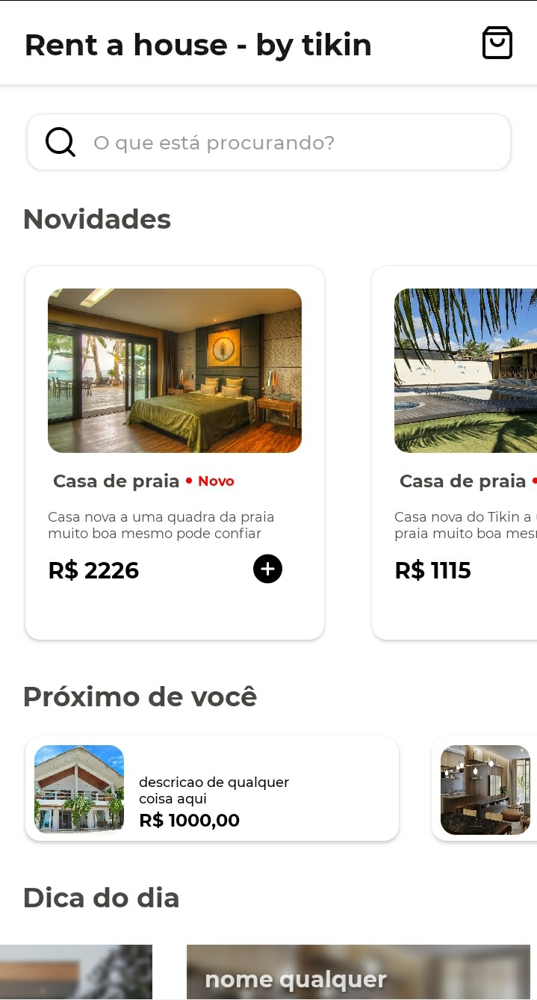

<!--
*** Thanks for checking out the Best-README-Template. If you have a suggestion
*** that would make this better, please fork the repo and create a pull request
*** or simply open an issue with the tag "enhancement".
*** Thanks again! Now go create something AMAZING! :D
***
***
***
*** To avoid retyping too much info. Do a search and replace for the following:
*** github_username, repo_name, twitter_handle, email, project_title, project_description
-->


<!-- PROJECT SHIELDS -->
<!--
*** I'm using markdown "reference style" links for readability.
*** Reference links are enclosed in brackets [ ] instead of parentheses ( ).
*** See the bottom of this document for the declaration of the reference variables
*** for contributors-url, forks-url, etc. This is an optional, concise syntax you may use.
*** https://www.markdownguide.org/basic-syntax/#reference-style-links
-->
<!--
[![Contributors][contributors-shield]][contributors-url]
[![Forks][forks-shield]][forks-url]
[![Stargazers][stars-shield]][stars-url]
[![Issues][issues-shield]][issues-url]
[![MIT License][license-shield]][license-url]
[![LinkedIn][linkedin-shield]][linkedin-url]
-->


<!-- PROJECT LOGO -->
<br />
<p align="center">
  
    
    

  <h3 align="center">RENT A HOUSE - UI</h3>
  
</p>
<!-- ABOUT THE PROJECT -->
## Sobre
<p align="center">
    <p>
    RENT A HOUSE - UI
    <br />
    É um conceito de interface desenvolvida utlizando Ract native, com intuito de servir como base para o desenvolvimento de um sistema de aluguel de casa por temporada.
    </p>     
  </p>


### Desenvolvido com 

* Node js
* React native

<!-- GETTING STARTED -->
## Iniciando

Siga os seguintes passos para iniciar o projeto.

### Instalação

1. Obtenha uma cópia do repositorio.
   ```sh
   git clone https://github.com/71K1N/rentaHouse.git
   ```
2. Instale todos os pacotes.
   ```sh
   npm install
   ```

<!-- USAGE EXAMPLES -->
## Execute

Para iniciar o projeto basta digitar
```sh
npm start
```
Após a execução leia o QR code atraves do Expo. Que deve ser instalado no seu celular.


<!-- LICENSE -->
## License

Distributed under the MIT License. See `LICENSE` for more information.